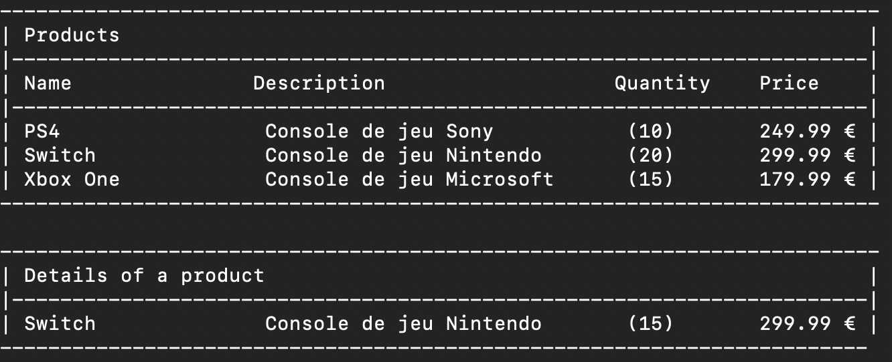
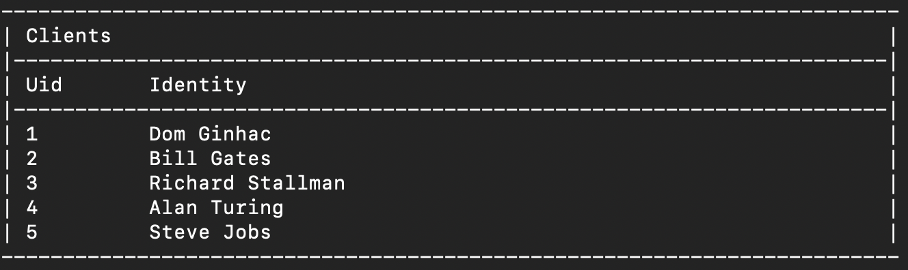

# TP2 C++ : EasyStore

[_http://ginhac.com/teaching/ITC313/TP2.pdf_](http://ginhac.com/teaching/ITC313/TP2.pdf)

# Préambule

## Quelques bonnes habitudes à prendre lorsqu'on fait de la programmation informatique

Avant chaque écriture de programme (quel que soit le langage), il faut successivement :

(a) Analyser le problème à résoudre

(b) Proposer un algorithme / méthode permettant de résoudre le problème posé.

(c) En déduire le programme associé.

(d) Simuler l'exécution du programme avec des valeurs assez variées.

(e) S'il y a des erreurs revenir au point (c), (b) ou (a).

Les points (a) et (b) doivent se dérouler loin du clavier car ils sont totalement indépendants de tout langage de programmation. Un problème bien compris est ensuite facile à transcrire dans un langage ou un autre !

# Préambule à tous les TP

1. La version numérique des sujets de TP est disponible sur le compte GitHub de l'enseignant : [https://github.com/dginhac/esirem-itc313](https://github.com/dginhac/esirem-itc313)
2. Vous utiliserez Git/GitHub en appliquant ce que vous avez vu en TD. N'oubliez pas de faire des « commits » réguliers. Avant la fin de la première séance, vous enverrez un email à votre Professeur ([dginhac@u-bourgogne.fr](mailto:dginhac@u-bourgogne.fr)) pour lui indiquer le nom du compte GitHub sur lequel il pourra constater l'avancée du travail. Si vous créez un projet GitHub privé, vous devrez inviter le Professeur pour qu'il puisse accéder à votre code.
3. Sur votre compte GitHub, vous nommerez les projets ITC313-TP1, ITC313-TP2, etc. afin que le suivi des projets par l'enseignant puisse se faire facilement pour toutes les seances.
4. Pour chaque TP, vous indiquerez l'avancée de votre travail dans le fichier README.md de GitHub, ce qui permettra à l'enseignement de voir en un coup d'œil l'avancée de votre travail.
5. Chaque commit devra comporter dans son message d'information le numéro de la question. Par exemple « Q1.a : création de la classe XXXX », « Q2.b : ajout de la méthode YYYY à la classe XXXX »
6. Pour effectuer la compilation de vos fichiers, vous devrez utiliser le « Makefile » fourni et l'adapter en fonction des noms des fichiers que vous allez créer. Soyez tout de même logique en appelant les fichiers .h et .cpp du nom des classes que vous créez.
7. Toutes les variables membres de toutes les classes créées dans ce TP seront définies en « private ». Il est donc nécessaire de créer certains getters/setters pour pouvoir accéder à ces variables membres.
8. N'oubliez pas de mettre des commentaires dans vos codes. Ils vous permettront (ainsi qu'à l'enseignant qui vous corrigera) de bien comprendre ce que vous avez écrit.

# Introduction

Le TP consiste à concevoir une application de magasin en ligne nommé EasyStore. Ce TP vous permettra d'utiliser les références, les pointeurs et les allocations dynamiques.

La gestion de ce magasin nécessite la création de plusieurs classes : Produit, Client, Commande.

Un Produit peut être constitué des informations suivantes :

- Un titre (ex : « PS4 »),
- Une description (ex : « Console de jeu de marque Sony »),
- Une quantité disponible (ex : 10),
- Un prix unitaire (ex : 249,99€).

Un Client peut être constituée des informations suivantes :

- Un prénom (ex : « Dominique »),
- Un nom (ex : « Ginhac »),
- Un panier d'achat, c'est-à-dire un tableau de produits sélectionnés qui sont attente de validation pour la commande. Une fois la commande validée, le panier d'achat est vidé automatiquement.

Une Commande peut être constitué des informations suivantes :

- Un client,
- Un tableau des produits commandés,
- Un statut de la commande (Ex : livrée / pas livrée).

Attention, pour chacune de ses classes, vous devez vous assurer qu'on puisse bien identifier les objets. Certaines de ces classes ont peut-être besoin d'identifiants supplémentaires. Typiquement, la classe Client nécessite un identifiant unique car le nom / prénom n'est pas unique (homonymes).

Le magasin EasyStore est représenté sous la forme d'une classe Magasin comprenant impérativement les éléments suivants :

- Un tableau de pointeurs vers des Produits (`std::vector<Product*> m_products`)
- Un tableau de pointeurs vers des Clients (`std::vector<Client*> m_clients`)
- Un tableau de pointeurs vers des Commandes (`std::vector<Order*> m_orders`)

L'utilisation des pointeurs et la gestion dynamique (avec les opérateurs `new` et `delete`) des différents éléments (Produits, Clients, Commandes) vous permettra de vous familiariser avec les principes clés de l'allocation dynamique.

Pour chacune des questions, on suppose que tous les paramètres passés aux constructeurs des classes sont valides, ce qui permet de créer les objets.

Par contre, il est indispensable de s'assurer au préalable que ces paramètres sont bons. Par exemple, avant de valider une commande, il est nécessaire de vérifier que le produit est disponible.


# Création des classes

## Question 1 : Création de la classe Magasin

1.a) Créer la classe Magasin avec ses 3 variables membres, son constructeur

1.b) Ecrire un programme principal permettant de créer un objet (vide) de type magasin.

## Question 2 : Création de la classe Produit

2.a) Créer la classe Produit avec ses variables membres, son constructeur et ses fonctions getters. Ajouter une méthode permettant de modifier la quantité disponible.

2.b) Surcharger l'opérateur << pour pouvoir afficher un produit.

## Question 3 : Ajout de fonctionnalités à Magasin

3.a) Ajouter à la classe Magasin une méthode permettant d'ajouter un nouveau produit au magasin.

3.b) Ecrire une méthode permettant d'afficher à l'écran tous les produits référencés dans le magasin.

3.c) Ecrire une méthode permettant d'afficher à l'écran un produit sélectionné par son nom.

4.c) Ecrire une méthode permettant de mettre à jour la quantité d'un produit sélectionné par son nom.

Ex d'utilisation :

```
/* Create easyStore */
Store my_easystore;

// Add products to the store with Title, Description, Price and Quantity
my_easystore.add_product_to_store("Console de jeu Sony", 249.99,10);
my_easystore.add_product_to_store("Switch", "Console de jeu Nintendo", 299.99,30);
my_easystore.add_product_to_store("Xbox One", "Console de jeu Microsoft", 179.99,15);

// Display all the products
my_easystore.display_products();

// Update quantity of a product
my_easystore.update_product_quantity("Switch", 20);

// Display the updated product
my_easystore.display_product("Switch");
```



## Question 4 : Création de la classe Client

4.a) Créer la classe Client avec ses variables membres (identifiant, prenom, nom, panier d'achat) et ses fonctions getters.

4.b) Ajouter une méthode permettant d'ajouter un produit au panier d'achat.

4.c) Ajouter une méthode permettant de vider le panier d'achat.

4.d) Ajouter une méthode permettant de modifier la quantité d'un produit ajouté au panier d'achat

4.e) Ajouter une méthode permettant de supprimer un produit du panier d'achat.

4.f) Surcharger l'opérateur << pour pouvoir afficher toutes les informations du client (incluant les produits du panier d'achat.

## Question 5 : Ajout de fonctionnalités à Magasin

5.a) Ajouter à la classe Magasin une méthode permettant d'ajouter un nouveau client au magasin.

5.b) Ecrire une méthode permettant d'afficher à l'écran tous les clients du magasin.

5.c) Ecrire une méthode permettant d'afficher à l'écran un client sélectionné par son nom ou son identifiant.

5.d) Ecrire une méthode permettant d'ajouter un produit au panier d'achat d'un client.

5.e) Ecrire une méthode permettant de supprimer un produit au panier d'achat d'un client.

5.f) Ecrire une méthode permettant de modifier la quantité d'un produit du panier d'achat d'un client.

Ex d'utilisation :
```
// Add new clients
my_easystore.add_client("Dom", "Ginhac");
my_easystore.add_client("Bill", "Gates");
my_easystore.add_client("Richard", "Stallman");
my_easystore.add_client("Alan", "Turing");
my_easystore.add_client("Steve", "Jobs");

// Display all the clients
my_easystore.display_clients();

// Display clients "Richard Stalman" and 4
my_easystore.display_client("Richard", "Stallman");
my_easystore.display_client(4);

// Add a product with its title and add to a client identified by his name
my_easystore.add_product_to_shopping_cart("Casque RV PS", "Richard", "Stallman");

// Add a product with its title and add to a client identified by his uid
my_easystore.add_product_to_shopping_cart("Casque Audio", 4);
```



## Question 6 : Création de la classe Commande

6.a) Créer la classe Commande avec ses variables membres (client, produits achetés, statut).

6.f) Surcharger l'opérateur << pour pouvoir afficher toutes les informations de la commande.

## Question 7 : Ajout de fonctionnalités à Magasin

7.a) Ajouter à la classe Magasin une méthode permettant de valider une commande

7.b) Ajouter une méthode permettant de mettre à jour le statut d'une commande

7.c) Ajouter une méthode permettant d'afficher toutes les commandes passées.

7.d) Ajouter une méthode permettant d'afficher toutes les commandes d'un client donné.

## Question 8 : Questions subsidiaires

8.a) Dans le programme principal, créer un menu permettant de sélectionner l'action à faire : gestion du magasin, gestion des utilisateurs, gestion des commandes. Pour chacun des actions, créer un sous menu avec les options correspondantes. Par exemple, pour gestion du magasin, ajouter les commandes : ajout d'un produit, affichage des produits, mise a jour des quantités, …

8.b) Ecrire le code nécessaire à l'enregistrement et à la lecture des données (produits, clients et commandes) dans des fichiers.