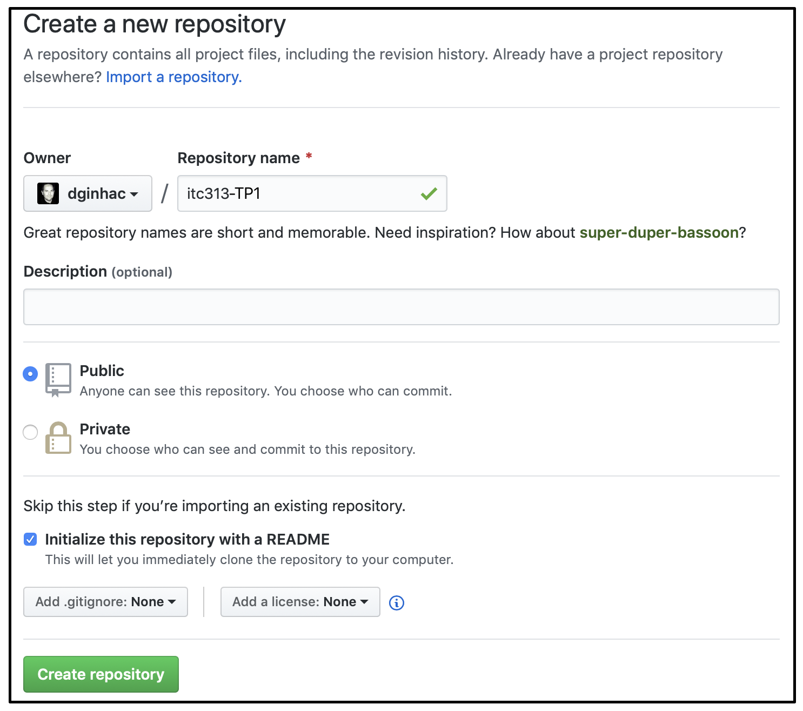

# Tutorial GitHub en 15 minutes

Le but de ce tutorial est de lister toutes les commandes nécessaires à :
* la création d'un dépot sur GitHub
* la synchronisation de ce dépot par 2 développeurs (au moins)
* la collaboration au minimum de ces développeurs pour écrire du code

Avant toute création d'un dépot sur GitHub, il est nécessaire que chacun des 2 développeurs créent un compte sur GitHub. Dans la suite de ce tutorial, nous les nommerons `dev1` et `dev2`.

## Création d'un dépot sur GitHub par `dev1`

1. Le développeur `dev1` prend le rôle de "Project leader". Le développeur `dev2` se met en attente pour l'instant.
2. Il crée un dépot (i.e "repository", pas un projet) nommé par exemple `itc313-TP1` (voir copie ecran ci-dessous)
    * Le dépot peut être "Public" (c'est-à-dire lisible par tout le monde) ou "Private" (c'est-à-dire accessible uniquement par les développeurs invités).
    * Le dépot peut être initialisé avec un fichier Readme dans lequel on donne des informations sur le dépot
    * Le dépot peut être créé avec une licence (Ex GPL , Apache, MIT, ...) ou pas.
    * Pour l'instant, le .gitignore peut être laissé à "None".



3. Une fois le dépot itc313 créé, le développeur `dev1` ouvre la page "settings" et invite le développeur `dev2` sur le dépot choisi. Attention, le développeur `dev2` va recevoir un mail et devra valider l'invitation pour qu'elle soit effective.

C'est maintenant terminé sur GitHub. Tout le reste peut se passer sur les machines des développeurs `dev1` et `dev2`.


## Clone du dépot GitHub sur l'ordinateur de `dev1` qui est `Project Leader`

Toutes les opérations se passent dans un terminal.

* Création d'un directory itc3113 : `mkdir itc313`
* Clone du dépot distant : `git clone https://dev1@github.com/dev1/itc313-TP1.git` (Bien sur `dev1` est à remplacer par le nom du développeur 1 et `itc313-TP1` par le nom du dépot choisi). Le `dev1@` indique qu'on se connecte avec le login `dev1` sur `github.com`. Le `dev1/itc313-TP1.git` indique qu'on essaie de récupérer le dépot `itc313-TP1` qui a été créé par `dev1`. Si le dépot est "Private" alors un mot de passe sera demandé.
* Vous pouvez aussi le faire en ssh avec la commande `git clone git@github.com:dev1/itc313-TP1.git`. L'intérêt d'utiliser ssh est de pouvoir déposer ses clés ssh publiques sur github et ainsi vous n'aurez plus à saisir de mots de passe (voir https://help.github.com/en/github/authenticating-to-github/adding-a-new-ssh-key-to-your-github-account)
* Si tout se passe bien, vous allez récupérer le contenu du dépot (le fichier Readme.md pour l'instant) dans un dossier nommé `itc313-TP1`.
* Si ce n'est pas le cas, regarder le message d'erreur et recommencer éventuellement les opérations.

## Clone du dépot GitHub sur l'ordinateur de `dev2` qui est `Collaborator`
* Création d'un directory itc3113 : `mkdir itc313`
* Clone du dépot distant : `git clone https://dev2@github.com/dev1/itc313-TP1.git` (Bien sur `dev1` et `dev2` sont à remplacer par le nom des développeurs et `itc313-TP1` par le nom du dépot choisi). Le `dev2@` indique qu'on se connecte avec le login `dev2` sur `github.com`. Le `dev1/itc313-TP1.git` indique qu'on essaie de récupérer le dépot `itc313-TP1` qui a été créé par `dev1` (le `Project Leader`) et qui est accessible par `dev2` suite à l'invitation faite. Si le dépot est "Private" alors un mot de passe sera demandé.
* Si tout se passe bien, vous allez récupérer le contenu du dépot (le fichier Readme.md pour l'instant) dans un dossier nommé `itc313-TP1`.
* Si ce n'est pas le cas, regarder le message d'erreur et recommencer éventuellement les opérations.

## Travail collaboratif de `dev1` et `dev2`

Chacun des 2 développeurs peut maintenant travailler en toute sérénité sur sa machine. Attention tout de même à bien se répartir le travail afin de minimiser les risques de conflit.

Pour les TPs, une stratégie facile à mettre en oeuvre est de se répartir les questions. Pour le TP1, les premières questions sont indépendantes et peuvent facilement être traitées en parallèles par `dev1` et `dev2`.

Prenons par exemple la répartition suivante : 
* `dev1` va traiter la Question 1 sur la classe Date
* `dev2` va traiter la Question 2 sur la classe Client

### Ecriture du code par `dev1`
Sur son ordinateur, `dev1` va effectuer les opérations suivantes :

* Création d'une branche "Question1" :  `git branch Question1`
* Bascule sur la branche "Question1" : `git checkout Question1`
* Création des fichiers Date.h, Date.cpp, Date-test.cpp 
* Pour la compilation, [télécharger le Makefile](https://github.com/dginhac/esirem-itc313/blob/master/TP/Makefile) proposé avec le sujet du TP dans le dépot GitHub https://github.com/dginhac/esirem-itc313/)
* Renommer votre `Makefile` en `Makefile.date` et modifier la ligne 7 en mettant `SRCS = Date.cpp Date-test.cpp` et la ligne 11 en mettant `TARGET = Date-test`
* Pour compiler, utiliser la commande `make -f Makefile.date`

Une fois que tout est fonctionnel, vous aller pouvoir passer au `commit` des fichiers.

### Ecriture du code par `dev2`
Sur son ordinateur, `dev2` va effectuer les opérations suivantes :

* Création d'une branche "Question2" :  `git branch Question2`
* Bascule sur la branche "Question2" : `git checkout Question2`
* Création des fichiers Client.h, Client.cpp, Client-test.cpp 
* Pour la compilation, [télécharger le Makefile](https://github.com/dginhac/esirem-itc313/blob/master/TP/Makefile) proposé avec le sujet du TP dans le dépot GitHub https://github.com/dginhac/esirem-itc313/)
* Renommer votre `Makefile` en `Makefile.client` et modifier la ligne 7 en mettant `SRCS = Client.cpp Client-test.cpp` et la ligne 11 en mettant `TARGET = Client-test`
* Pour compiler, utiliser la commande `make -f Makefile.client`

Une fois que tout est fonctionnel, vous aller pouvoir passer au `commit` des fichiers. Attention, vous pouvez faire plusieurs commit par Question (typiquement un par sous question.)


### Commit local des fichiers par `dev1` ou `dev2`
* `git status` va permettre de lister les fichiers non encore suivis et les fichiers modifiés depuis le dernier commit.
* Parmi les fichiers, on ne veut versionner que les fichiers `.cpp`, `.h` et `Makefile`. On ne versionne pas ni les fichiers de dépendances (.d), ni les fichiers objets (.o), ni les fichiers exécutables (Date-test ou Client-Test).
* Pour cela, on va creer un fichier `.gitignore` et lui ajouter les lignes suivantes : 
```
*.o 
*.d 
*-test
```
* En refaisant un `git status`, seuls vont apparaitre les fichiers `.h`, `.cpp`, `.gitignore` et `Makefile` 
* `git add .` va ajouter les fichiers 
* `git commit -m "Question X : Fonctionnalité ok"` (Attention a être explicite dans le message mis dans le commit)

Ce processus est réitéré pour chaque développeur pour toutes les sous questions de la classe Date ou Client.

Une fois fait, `dev1` a résolu la question 1 dans la branche locale `Question1` et `dev2` a fait de même dans la branche locale `Question2`.

### Fusion locale

Lorsqu'une question est complétement achevée et validée, on peut fusionner la branche `Question` avec la branche `master`
* `git checkout master` pour se repositionner dans la branche `master`
* `git merge Question1` pour `dev1` et `git merge Question2` pour `dev2`
* Si tout se passe bien, vous pouvez ensuite détruire la branche devenue inutile avec `git branch -d Question1` ou `git branch -d Question2`. 
* Si ca se passe mal, le message vous indiquera quel fichier a échoué et vous devrez éditer ce fichier, corriger manuellement la zone de conflit, refaire un `git add .`, un `git commit -m "merge manuel de ...`

Au final, vous aurez intégré le code développé dans la branche 'Question' dans la branche principale `Master`.

### Envoi de la branche `Master` vers `GitHub`
Une fois qu'une nouvelle fonctionnalité a été intégré dans la branche `Master` en local, il faut l'envoyer sur le dépot distant `GitHub` pour que l'autre développeur puisse la récupérer.

Imaginons que `dev1` finisse avant `dev2`.

`dev1` va faire :

* `git branch` pour s'assurer d'être sur la branche `master`. Si ce n'est pas le cas, faire un `git checkout master` pour y aller.
* `git push -u origin master`  permet d'envoyer la branche locale `master` vers la branche `master` du dépot distant (nommé `origin`). L'option `-u` permet de mémoriser l'association entre branche locale `master` et branche distante `master`. Cela permet ensuite de taper uniquement la commande `git push`
* Normalement tout se passe bien. `dev1` a envoyé son code vers `GitHub` et vous pouvez le vérifier sur le site.
* Si ce n'est pas le cas, c'est que l'autre développeur a fait un `git push` avant vous. Dans ce cas, se reporter plus bas et faire comme si on était `dev2`.

`dev2` va faire :

* `git branch` pour s'assurer d'être sur la branche `master`. Si ce n'est pas le cas, faire un `git checkout master` pour y aller.
* Récupérer les commits que `dev1` a envoyé sur `GitHub` en faisant `git pull origin master`.
* Ensuite, faire `git push -u origin master`  pour envoyer la branche locale `master` vers la branche `master` du dépot distant (nommé `origin`). L'option `-u` permet de mémoriser l'association entre branche locale `master` et branche distante `master`. Cela permet ensuite de taper uniquement la commande `git push`
* Normalement tout se passe bien. `dev2` a envoyé son code vers `GitHub` et vous pouvez le vérifier sur le site.

A partir de ce moment là, le dépot `GitHub` possède tous les commits des 2 développeurs.

`dev1` doit faire un dernier `git pull` pour récupérer les commits de `dev2` et avoir une version parfaitement synchronisée.

### A retenir

* Bien se repartir les fonctionnalités entre les développeurs
* Créer une branche par fonctionnalité
* Faire des commits reguliers avec des messages explicites pendant le développement de la fonctionnalité
* Une fois la fonctionnalité validée, fusionner la branche avec `master`
* Faire un `git pull` avant de faire un `git push` permet de s'assurer de bien avoir la version a jour sur sa machine avant d'essayer de mettre à jour le dépot GitHub.


