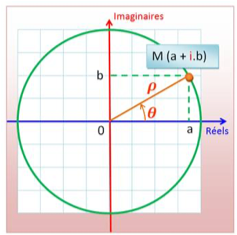

Exam Programmation C/C++ - Année 2018/2019
==========================================

Durée : 1h30 - Documents papiers autorisés  
Ordinateurs / Tablettes / SmartPhones interdits

Question 1 : Une classe Complexe
--------------------------------

Un nombre complexe peut se définir avec deux représentations
différentes :

* La forme cartésienne z=a+ib avec a la partie réelle et b la partie imaginaire, a et b étant des nombres réels
* La forme polaire z=ρ cos θ + i ρ sin θ avec ρ le module et θ l'angle avec l'axe des x, ce qui permet d'écrire, ρ et θ étant des nombres réels



1. Ecrire une classe C++ comprenant une représentation complexe sous la forme cartésienne. Cette classe comprendra 2 variables membres privées (partie réelle a et partie imaginaire b) et un constructeur avec des valeurs réelles et imaginaires nulles par défaut.
2. Ajouter deux fonctions LireReel et LireImag permettant de lire les variables a et b.
3. Ajouter une fonction ModifierComplexe qui permet de changer le nombre complexe a+ib.
4. Ajouter une fonction RepPolaire permettant de calculer la représentation polaire du nombre complexe à partir de sa représentation cartésienne (utiliser les opérateurs sqrt et atan2 de la librairie math pour le calcul de la racine carrée et de l'arc tangente).
5. Quelle que soit la forme de représentation d'un nombre complexe, on utilise toujours 2 paramètres (a et b pour la représentation cartésienne ou ρ et θ pour la représentation polaire). Peut-on rendre plus générique la classe Complexe en ajoutant un constructeur qui calculerait et stockerait automatiquement les valeurs a et b à partir des deux valeurs ρ et θ passées en paramètre ? Si oui, écrire le constructeur. Si non, comment faire ?

Question 2 : Une classe CoffreFort 
-----------------------------------

Soit un coffre-fort dont la combinaison comporte un nombre variable de
chiffres compris entre 0 et 9. Soit la classe C++ représentant un modèle
générique de coffre-fort :

```c++
class Coffre {
  private :
  int m_nb; // le nombre de chiffres de la combinaison
  int *m_code; // la combinaison
} ;
```

Cette classe comporte 2 variables membres dont la première m\_nb est le
nombre de chiffres de la combinaison et la deuxième est la combinaison
sous la forme d'un pointeur vers un tableau d'entiers. Par défaut un
coffre-fort possède une combinaison à 4 chiffres initialisée à 0000.

L'exercice consiste à implémenter plusieurs fonctions membres ou amies
de la classe.

1. Ecrire le constructeur de la classe qui permet d'instancier un nouveau coffre générique avec l'instruction suivante : `Coffre c1` ;
2. Ecrire le constructeur qui permet d'instancier un nouveau coffre avec l'instruction suivante : `Coffre c2 = Coffre(6, code);` avec code défini par `int code[6] = {1,2,6,7,4,5};` 
3. Ecrire le constructeur par copie de la classe qui permet de définir `Coffre c3 = c2;``
4. Ecrire le destructeur de la classe.
5. Ecrire la fonction « change » qui permet de modifier la combinaison sans changer le nombre de chiffres : `c2.change(code2)` avec `int code2[6] = {6, 7, 8, 2, 3, 4};`
6. Surcharger cette fonction pour changer également le nombre de chiffres : `c2.change(3, code3)` avec `int code3[3] = = {8, 4, 8};`
7. En déduire une fonction « reset » qui fait une réinitialisation de la combinaison à 0000.
8. Ecrire la fonction « verif » qui vérifie que la combinaison passée en paramètre est identique à celle stockée dans le coffre-fort : `c2.verif(code3)`
9. Réecrire cette fonction en surchargeant l'opérateur ==, ce qui permet de faire directement la comparaison `if (c2 == code3)`

Question 3 : Un peu de code à comprendre 
-----------------------------------------

Qu'affiche le code suivant ?  

```c++
#include <iostream>
using namespace std;

template <typename T=int, int count=3> T XXXX(T x) {
  for(int i=1; i<=count; i++) {
    cout << i << ": " << x << endl;
    x += i * x;
}
return x;
};

int main() {
  int xi = 2;
  int rxi = XXXX<>(xi);
  cout << xi << ": " << rxi << endl;
  float xf = 2.5;
  float rxf = XXXX<float, 4>(xf);
  cout << xf << ": " << rxf << endl;
  return 1;
}
```
